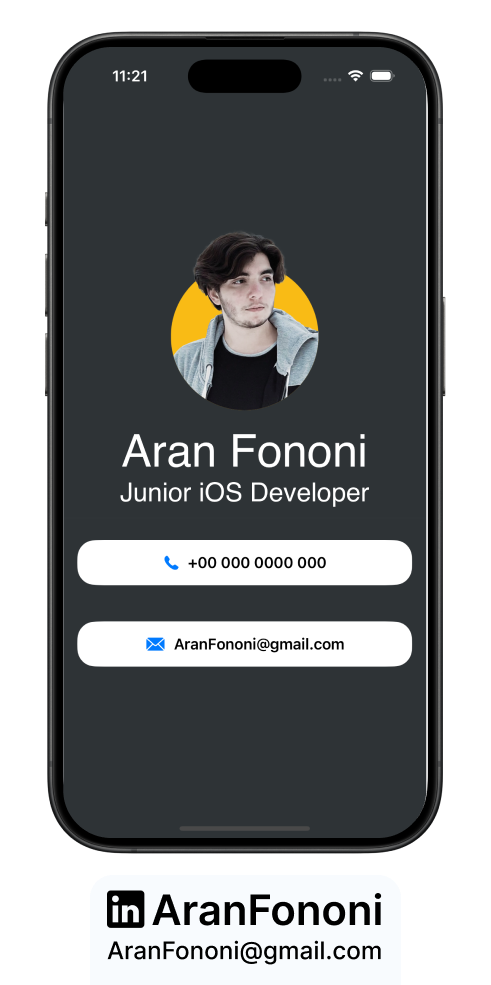
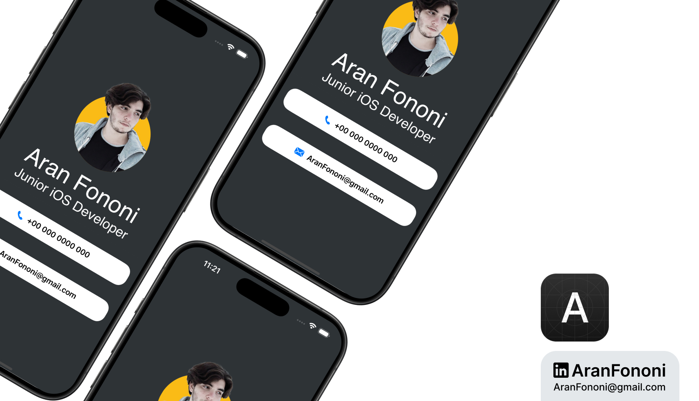

# Resume App

### Project for Section 17: **Personal Resume Application**  
This project was completed as part of Section 17 in the **Complete iOS Development Bootcamp** by Angela Yu.

## Project Overview
**Resume App** is a SwiftUI application designed to showcase a personal resume in a visually appealing format. The app highlights essential information such as name, job title, and contact details in a structured layout.

## What I Learned
In this project, I focused on:
- **SwiftUI Layouts**: Gained experience in creating user interfaces with SwiftUI's layout system, utilizing stacks and colors.
- **Custom Fonts**: Learned how to apply custom fonts and styles to enhance the visual appeal of text elements.
- **Image Integration**: Used images effectively to represent personal branding in the resume.

## Key Skills
- Proficient in building layouts using VStack and ZStack
- Experience in customizing views with colors and fonts
- Understanding of how to integrate images within SwiftUI applications

## Additional Features
- A clean and professional design that effectively communicates personal information.
- Dynamic info views for displaying contact details using a reusable `InfoView` component.

---

### Project Preview

---

### Footer

---

## Contact
For more information, feel free to reach out:  
- **Email**: [aranfononi@gmail.com](mailto:aranfononi@gmail.com)  
- **LinkedIn**: [Aran Fononi](https://www.linkedin.com/in/aran-fononi-18182b265)
